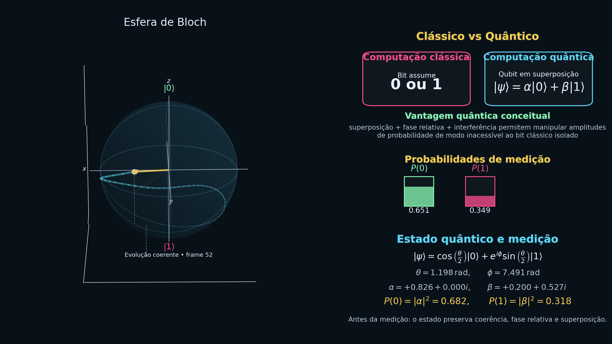

Segue uma **descrição completa e profissional para o `README.md`** do seu projeto.

---

# Bloch Sphere Quantum Animation

Este projeto apresenta uma **animação científica da Esfera de Bloch** desenvolvida em Python para visualizar de forma clara e intuitiva a dinâmica de um qubit em computação quântica. A simulação ilustra conceitos fundamentais da mecânica quântica, incluindo **superposição, evolução coerente do estado e colapso de medição**.

A animação mostra a trajetória do vetor de estado de um qubit na esfera de Bloch enquanto o sistema evolui no espaço de Hilbert. Durante a evolução, o estado é representado por um vetor tridimensional cuja posição é determinada pelos parâmetros angulares ( \theta ) e ( \phi ). Em determinado instante ocorre uma **medição quântica**, que projeta o estado em um dos autovetores da base computacional ( |0\rangle ) ou ( |1\rangle ), de acordo com as probabilidades associadas às amplitudes complexas do estado.

Além da visualização da esfera de Bloch, o projeto inclui **painéis informativos** que exibem:

* comparação conceitual entre **computação clássica e computação quântica**
* evolução das **probabilidades de medição**
* representação matemática do estado quântico
* amplitudes complexas do qubit
* interpretação física do processo de medição

Essa abordagem permite compreender não apenas a geometria da esfera de Bloch, mas também a relação entre a representação matemática do estado quântico e os resultados observáveis de uma medição.

---

## Conceitos Demonstrados

O projeto explora diversos conceitos fundamentais da computação quântica:

* Qubit como vetor em um espaço de Hilbert bidimensional
* Representação geométrica na **Esfera de Bloch**
* Superposição quântica
* Fase relativa entre amplitudes
* Probabilidades de medição
* Colapso do estado quântico
* Evolução coerente do sistema

---

## Tecnologias Utilizadas

* **Python**
* **NumPy**
* **Matplotlib**
* **Pillow**
* **ImageIO**

Essas bibliotecas são utilizadas para modelar matematicamente o estado quântico e gerar a visualização tridimensional da esfera de Bloch e dos painéis informativos.

---

## Como Executar

1. Clone o repositório

```bash
git clone https://github.com/seu-usuario/bloch-sphere-animation.git
```

2. Instale as dependências

```bash
pip install -r requirements.txt
```

3. Execute o script

```bash
python bloch_sphere_animation.py
```

Ao final da execução, será gerado um arquivo GIF com a animação:

```
bloch_quantum_clean.gif
```
 
---

## Aplicações

Este projeto pode ser utilizado em diversos contextos:

* ensino de **computação quântica**
* visualização didática de estados quânticos
* apresentações acadêmicas
* divulgação científica
* material educacional em física quântica

